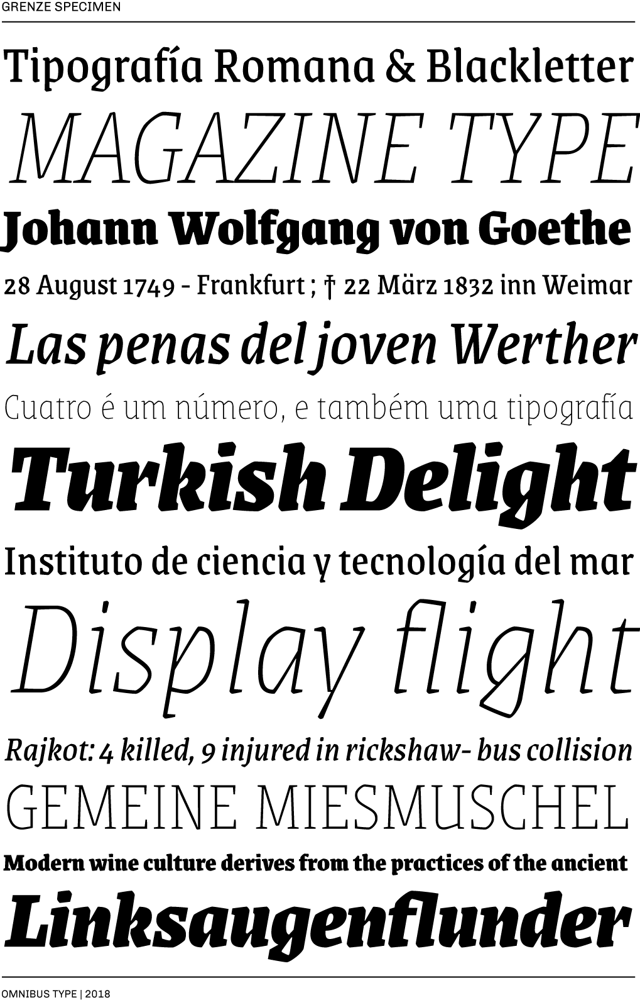

# Grenze family

**Omnibus-Type**  
*SIL Open Font License, 1.1*

<<<<<<< HEAD

=======

>>>>>>> fd8bf038428fe0ca02914e6840b22fe00437bce6

####Grenze Family contains:

* Thin/ThinItalic
* ExtraLight/ExtraLightItalic
* Light/LightItalic
* Regular/Italic
* Medium/MediumItalic
* Semibold/SemiboldItalic
* Bold/BoldItalic
* ExtraBold/ExtraBoldItalic
* Black/BlackItalic

To contribute to the project contact [Omnibus Type](http://omnibus-type.com/).

### Designers

* Renata Polastri

### License

Copyright (c) 2011-2018, Omnibus-Type (www.omnibus-type.com omnibus.type@gmail.com)

Licensed under the [*SIL Open Font License, 1.1*](http://scripts.sil.org/OFL); you may not use this file except in compliance with the License.

======
## FONTLOG for the Grenze fonts

This file provides detailed information on the Grenze font software.  
This information should be distributed along with the Grenze fonts and any derivative works.

### Grenze is a typeface family that supports Unicode language range: 

* Basic Latin 				U+0020-U+007E
* Latin-1 Supplement 		U+00A0-U+00FF
* Latin Extended-A 			U+0100-U+017F
* Latin Extended Additional*	U+1E00-U+1EFF *(111/256)

**Character map to support MS Codepages:**
* 1252 Latin-1
* 1250 Latin-2 (Easter Europe)
* 1254 Turkish
* 1257 Windows Baltic
* 1258 Vietnamese
* Mac Roman

*To contribute to the project contact Omnibus-Type at omnibus.type@gmail.com*

**02 Apr 2018 (v.1.001) Omnibus-Type**  
- Initial release

### Acknowledgements

If you make modifications be sure to add your name (N), email (E), web-address
(if you have one) (W) and description (D). This list is in alphabetical order.

**N:** **Renata Polastri**  
**E:** omnibus.type@gmail.com  
**W:** http://www.omnibus-type.com  
**D:** Designer

**N:** **Oscar Guerrero Cañizares**  
**E:** omnibus.type@gmail.com  
**W:** http://www.omnibus-type.com  
**D:** Typeface development

**N:** **Pablo Cosgaya**  
**E:** omnibus.type@gmail.com  
**W:** http://www.omnibus-type.com  
**D:** Typeface development

**N:** **Yorlmar Campos**  
**E:** omnibus.type@gmail.com  
**W:** http://www.omnibus-type.com  
**D:** Typeface development
